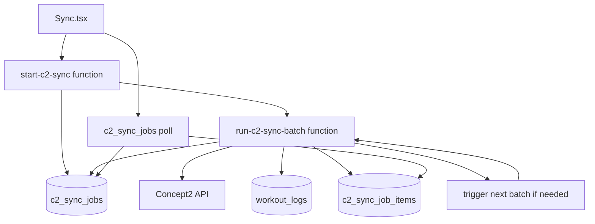

# Concept2 Background Sync Plan

> Last Updated: 2026-06-15
> Status: Proposed

## Problem

The current Concept2 sync runs in the browser through `useConcept2Sync`. That makes the sync vulnerable to iPad/iPhone browser behavior, tab suspension, page navigation, token refresh races, and long foreground network activity. A failed browser sync can fetch some Concept2 state but never persist workouts to `workout_logs`.

The goal is to let a user start a sync, leave the page or lose connection, and later check progress from durable Supabase state.

## Constraint: Supabase Function Timeouts

Supabase Edge Functions are not an unlimited background worker. The design must assume each invocation can be stopped by platform limits. Use short, resumable batches rather than one long all-history sync.

Design implications:

- Do not keep the browser request open until sync completion.
- Do not depend on one function invocation finishing an entire C2 account.
- Save progress after each page or small workout batch.
- Make every batch idempotent and resumable.
- Treat `EdgeRuntime.waitUntil()` as useful for continuing a bounded invocation after returning a response, not as a durable queue by itself.

## Target Architecture

## Proposed Tables

### `c2_sync_jobs`

Durable sync run state. One row per user-started sync.

Suggested columns:

| Column | Purpose |
|--------|---------|
| `id uuid primary key` | Job id returned to the browser |
| `user_id uuid not null` | Owner of the sync job |
| `status text not null` | `queued`, `running`, `completed`, `failed`, `partial_success`, `cancelled` |
| `range text not null` | `30days`, `season`, `all`, `custom` |
| `options jsonb not null default '{}'` | Machine filters, force resync, date range |
| `current_page integer` | Last C2 summary page processed or in progress |
| `total_pages integer` | Total pages once known |
| `total_workouts integer` | Total summary count once known |
| `processed_count integer default 0` | Workouts attempted |
| `saved_count integer default 0` | Workouts written/upgraded |
| `skipped_count integer default 0` | Existing or filtered workouts |
| `failed_count integer default 0` | Per-workout failures |
| `last_error text` | Last useful error for support/debugging |
| `started_at timestamptz` | First batch start time |
| `finished_at timestamptz` | Terminal status time |
| `created_at timestamptz default now()` | Created time |
| `updated_at timestamptz default now()` | Last progress update |

### `c2_sync_job_items`

Optional but recommended for supportability. One row per C2 result id seen by a job.

Suggested columns:

| Column | Purpose |
|--------|---------|
| `id uuid primary key` | Item row id |
| `job_id uuid not null` | Parent sync job |
| `user_id uuid not null` | Redundant owner for RLS and easier querying |
| `external_id text not null` | C2 result id |
| `status text not null` | `queued`, `processing`, `saved`, `skipped`, `failed` |
| `error text` | Per-workout failure detail |
| `created_at timestamptz default now()` | Created time |
| `updated_at timestamptz default now()` | Last item update |

For v1, this table can be omitted if we only need job-level counters. Add it before launch if we want good post-failure diagnostics.

## Function Boundaries

### `start-c2-sync`

Low-risk entrypoint.

Responsibilities:

- Require a valid Supabase user JWT.
- Validate requested range, dates, machine filters, and force-resync flag.
- Insert a `c2_sync_jobs` row for the authenticated user.
- Start the first batch invocation.
- Return `{ job_id }` immediately.

Must not:

- Fetch the full C2 history inline.
- Return Concept2 access or refresh tokens.
- Write workouts directly unless the first bounded batch is intentionally included and remains short.

### `run-c2-sync-batch`

Riskier worker function.

Responsibilities:

- Load the job and user integration tokens using service role privileges.
- Verify the job is not terminal and belongs to the expected user.
- Refresh Concept2 tokens server-side if needed.
- Fetch one C2 summary page or process a bounded number of queued item rows.
- Upsert to `workout_logs` using the existing mapping semantics.
- Save counters and `last_error` after each small unit of work.
- Trigger the next batch if more work remains.

Batch sizing should start conservative:

- One summary page at a time, or
- 10 to 25 workout detail/stroke fetches per invocation, or
- Stop early when elapsed time approaches a configured budget such as 60 to 90 seconds.

### Progress Query

Use direct Supabase reads from `c2_sync_jobs` and optionally `c2_sync_job_items`, protected by RLS. A separate `get-c2-sync-job` function is only needed if the UI needs derived status text or privileged diagnostics.

## Migration Plan

### Phase 1: Durable Job Schema

### Deliverables

- Add `c2_sync_jobs` migration.
- Add RLS policies so users can read their own jobs.
- Optionally add `c2_sync_job_items` and policies.
- Add generated TypeScript types.
- Add a minimal UI/service read path for job status if needed.

### Acceptance Criteria

- A logged-in user can see only their own sync jobs.
- Admin/service role can update job progress.
- No existing browser sync behavior changes.

### Validation

- SQL lint and migration review passes for new `c2_sync_jobs` and optional `c2_sync_job_items` objects.
- RLS query checks confirm user-scoped reads are enforced for job rows.
- Manual check verifies current browser sync path still runs with no code-path changes.

### Non-Goals

- No user-visible sync flow changes in this phase.
- No Concept2 token handling changes.
- No workout migration logic in this phase.

### Risks

- Migration order issues or type drift if DB schema changes are not aligned with current auth expectations.
- Missing RLS coverage could expose job rows if policy logic is incomplete.

### Phase 2: Start Job API

### Deliverables

- Add `start-c2-sync` Edge Function.
- Validate input and insert a queued/running job.
- Return `job_id` immediately.
- Optionally no-op the worker trigger at first, or trigger a stub worker that only marks the job started.

### Acceptance Criteria

- The browser can create a job and poll it.
- No workouts are migrated through the new path yet.
- Existing `useConcept2Sync` remains the production sync path.

### Validation

- Run function-level smoke tests (or direct invocations) to confirm `start-c2-sync` creates a `c2_sync_jobs` row and responds with `job_id`.
- Polling endpoint returns current `c2_sync_jobs` state after invocation.
- Confirm no frontend sync behavior changes are triggered through new API alone.

### Non-Goals

- No changes to token refresh logic yet.
- No full batch processing path.
- No migration off browser sync in UI.

### Risks

- API surface mismatch between UI contract and function payload.
- Invalid range/machine filter handling causing unusable queued jobs.
- Premature background trigger behavior if worker trigger is accidentally activated before schema and validations stabilize.

### Phase 3: Batch Worker Skeleton

### Deliverables

- Add `run-c2-sync-batch` with job locking/status transitions.
- Implement token lookup and refresh without returning secrets to the browser.
- Implement bounded execution and next-batch triggering.
- Initially process only summary pages and job counters, not full workout upserts.

### Acceptance Criteria

- A test job can move through pages and complete with summary counts.
- Re-running a batch does not corrupt job state.
- Failures leave useful `last_error` values.

### Validation

- Run bounded batch jobs against a test user and verify page counters update and stop conditions are respected.
- Re-run same batch path twice to confirm idempotent status transitions.
- Inject a mocked failure and verify job transitions to a partial/failed state with `last_error` populated.

### Non-Goals

- No full workout upserts in this phase.
- No template matching or PR cache updates yet.
- No UI cutover from browser sync yet.

### Risks

- Locking or status update races under repeated invocations.
- Overly broad retry behavior causing duplicate summary processing.
- Time-budget logic failing to yield before runtime cutoff.

### Phase 4: Port Workout Processing

### Deliverables

- Move the current browser workout mapping into server-side code.
- Preserve existing `workout_logs` field semantics, canonical names, zone distribution, template matching, assignment linking, PR cache behavior, and power bucket behavior where applicable.
- Add per-workout item status and error recording.

### Acceptance Criteria

- A server-side job can sync a narrow range, such as the last 30 days, for a test user.
- Results match the current browser sync output for the same Concept2 account and date range.
- Partial failures are visible and do not mark the whole job as successful unless at least one expected row saved/skipped correctly.

### Validation

- Compare sample output between background job and current browser sync for the same user/range.
- Run batch job with controlled partial failures to ensure item-level status and error capture.
- Confirm job completion status reflects `partial_success` when any items fail and `failed` when no progress is made.

### Non-Goals

- No large history (`all`) migration in this phase.
- No UI migration or sync button behavior changes.
- No new user controls beyond job status visibility.

### Risks

- Mapping semantic drift from browser logic (especially naming, PR cache, and zone handling).
- Longer batch execution windows due to heavy mapping, increasing timeout and retry complexity.
- Increased write conflicts against `workout_logs` if existing workflows touch same rows.

### Phase 5: UI Cutover

### Deliverables

- Change `Sync.tsx` from direct browser sync to job start + polling.
- Show durable progress from `c2_sync_jobs`.
- Keep the current browser sync behind a dev/debug fallback until the background path is proven.
- Update user-facing copy so users know they can leave and return later.

### Acceptance Criteria

- A user can start a sync, refresh or close the page, and later see the same job status.
- The UI no longer depends on iPad Safari staying awake for the whole sync.

### Validation

- Manual QA: start sync, background/close tab flow, reopen and confirm progress continuity from `c2_sync_jobs`.
- Automated/basic component check confirms polling updates without direct Concept2 fetch calls in the main path.
- Verify dev fallback remains reachable but opt-in from UI behavior.

### Non-Goals

- No removal of browser sync until production confidence checks pass.
- No new complex retry or cancel workflows yet.
- No major redesign of sync screens beyond source-of-truth shift.

### Risks

- Incorrect polling/backoff causing stale or noisy UI status.
- User confusion if fallback path and background path are both visible without clear labeling.
- Partial status visibility gaps while jobs are still in-progress migration states.

### Phase 6: Cleanup

### Deliverables

- Remove or demote the direct browser sync path once the background worker is stable.
- Add support/admin views for failed jobs if needed.
- Add retry/cancel controls if user demand appears.
- Update `docs/c2-sync-flow.md` to make the background worker the primary architecture.

### Acceptance Criteria

- Background worker path is the documented and preferred sync flow.
- Browser sync is no longer the default path for production users.
- Failed-state visibility and recoverability are demonstrably better than before cleanup.

### Validation

- Regression run across sync flows to confirm default behavior routes through `c2_sync_jobs`.
- Validate docs and internal runbooks reflect the worker-first model.
- Confirm support/retry workflows work for at least one failed and one retried job scenario.

### Non-Goals

- No deep support process redesign outside Concept2 sync.
- No speculative admin tooling beyond failure visibility.
- No API surface broadening outside existing sync functions and job tables.

### Risks

- Accidental regression for users still relying on the old browser flow.
- Incomplete operator guidance if rollback/cleanup steps are not documented.
- Premature retirement of fallback path before parity is proven.

## Open Questions

- Should v1 include `c2_sync_job_items`, or is job-level progress enough?
- How should concurrent jobs for the same user be handled: reject, cancel previous, or allow separate ranges?
- Should force-resync be allowed from the background path immediately, or after normal sync is proven?
- Should template matching and PR cache updates run inside each batch, at job completion, or as a follow-up maintenance step?
- What should the maximum supported `all` history sync size be before asking the user to start with a smaller range?

## Recommended First Chunk

Implement Phase 1 only:

1. Add the job tables and RLS.
2. Add TypeScript types.
3. Add a tiny service/helper for reading the latest job status.
4. Do not alter the current sync button behavior yet.

This creates the durable state foundation without touching the risky Concept2 fetch/write path.
