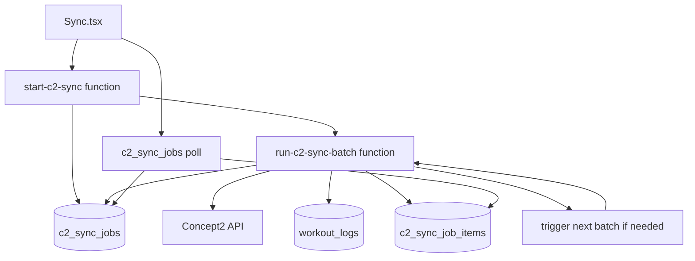

# Concept2 Background Sync Plan

> Last Updated: 2026-06-15
> Status: Proposed

## Problem

The current Concept2 sync runs in the browser through `useConcept2Sync`. That makes the sync vulnerable to iPad/iPhone browser behavior, tab suspension, page navigation, token refresh races, and long foreground network activity. A failed browser sync can fetch some Concept2 state but never persist workouts to `workout_logs`.

The goal is to let a user start a sync, leave the page or lose connection, and later check progress from durable Supabase state.

## Constraint: Supabase Function Timeouts

Supabase Edge Functions are not an unlimited background worker. The design must assume each invocation can be stopped by platform limits. Use short, resumable batches rather than one long all-history sync.

Design implications:

- Do not keep the browser request open until sync completion.
- Do not depend on one function invocation finishing an entire C2 account.
- Save progress after each page or small workout batch.
- Make every batch idempotent and resumable.
- Treat `EdgeRuntime.waitUntil()` as useful for continuing a bounded invocation after returning a response, not as a durable queue by itself.

## Target Architecture

## Proposed Tables

### `c2_sync_jobs`

Durable sync run state. One row per user-started sync.

Suggested columns:

| Column | Purpose |
|--------|---------|
| `id uuid primary key` | Job id returned to the browser |
| `user_id uuid not null` | Owner of the sync job |
| `status text not null` | `queued`, `running`, `completed`, `failed`, `partial_success`, `cancelled` |
| `range text not null` | `30days`, `season`, `all`, `custom` |
| `options jsonb not null default '{}'` | Machine filters, force resync, date range |
| `current_page integer` | Last C2 summary page processed or in progress |
| `total_pages integer` | Total pages once known |
| `total_workouts integer` | Total summary count once known |
| `processed_count integer default 0` | Workouts attempted |
| `saved_count integer default 0` | Workouts written/upgraded |
| `skipped_count integer default 0` | Existing or filtered workouts |
| `failed_count integer default 0` | Per-workout failures |
| `last_error text` | Last useful error for support/debugging |
| `started_at timestamptz` | First batch start time |
| `finished_at timestamptz` | Terminal status time |
| `created_at timestamptz default now()` | Created time |
| `updated_at timestamptz default now()` | Last progress update |

### `c2_sync_job_items`

Optional but recommended for supportability. One row per C2 result id seen by a job.

Suggested columns:

| Column | Purpose |
|--------|---------|
| `id uuid primary key` | Item row id |
| `job_id uuid not null` | Parent sync job |
| `user_id uuid not null` | Redundant owner for RLS and easier querying |
| `external_id text not null` | C2 result id |
| `status text not null` | `queued`, `processing`, `saved`, `skipped`, `failed` |
| `error text` | Per-workout failure detail |
| `created_at timestamptz default now()` | Created time |
| `updated_at timestamptz default now()` | Last item update |

For v1, this table can be omitted if we only need job-level counters. Add it before launch if we want good post-failure diagnostics.

## Function Boundaries

### `start-c2-sync`

Low-risk entrypoint.

Responsibilities:

- Require a valid Supabase user JWT.
- Validate requested range, dates, machine filters, and force-resync flag.
- Insert a `c2_sync_jobs` row for the authenticated user.
- Start the first batch invocation.
- Return `{ job_id }` immediately.

Must not:

- Fetch the full C2 history inline.
- Return Concept2 access or refresh tokens.
- Write workouts directly unless the first bounded batch is intentionally included and remains short.

### `run-c2-sync-batch`

Riskier worker function.

Responsibilities:

- Load the job and user integration tokens using service role privileges.
- Verify the job is not terminal and belongs to the expected user.
- Refresh Concept2 tokens server-side if needed.
- Fetch one C2 summary page or process a bounded number of queued item rows.
- Upsert to `workout_logs` using the existing mapping semantics.
- Save counters and `last_error` after each small unit of work.
- Trigger the next batch if more work remains.

Batch sizing should start conservative:

- One summary page at a time, or
- 10 to 25 workout detail/stroke fetches per invocation, or
- Stop early when elapsed time approaches a configured budget such as 60 to 90 seconds.

### Progress Query

Use direct Supabase reads from `c2_sync_jobs` and optionally `c2_sync_job_items`, protected by RLS. A separate `get-c2-sync-job` function is only needed if the UI needs derived status text or privileged diagnostics.

## Migration Plan

### Phase 1: Durable Job Schema

Risk: low.

Deliverables:

- Add `c2_sync_jobs` migration.
- Add RLS policies so users can read their own jobs.
- Optionally add `c2_sync_job_items` and policies.
- Add generated TypeScript types.
- Add a minimal UI/service read path for job status if needed.

Validation coverage:

- Verify the migration creates `c2_sync_jobs` with the Phase 1 status values and progress counters described above.
- Verify RLS allows an authenticated user to select only rows where `user_id = auth.uid()`.
- Verify RLS does not allow an authenticated user to select another user's job rows.
- Verify service-role/admin execution can update job progress fields such as `status`, page counters, processed/saved/skipped/failed counts, `last_error`, and timestamps.
- Verify existing browser Concept2 sync behavior still runs through `useConcept2Sync`; Phase 1 must not fetch workouts or write `workout_logs` through the new background path.

Phase 1 validation evidence should include:

- The migration file path and the exact `c2_sync_jobs` policy names reviewed or exercised.
- A user-owned read check that returns the seeded/authenticated user's job.
- A cross-user read check that returns no rows for a different authenticated user.
- A service-role/admin update check that changes at least one progress counter and `updated_at`.
- A build/type/lint/test result, or a specific blocker if local validation cannot run.

Done when:

- A logged-in user can see only their own sync jobs.
- Admin/service role can update job progress.
- No existing browser sync behavior changes.

### Phase 2: Start Job API

Risk: low to moderate.

Deliverables:

- Add `start-c2-sync` Edge Function.
- Validate input and insert a queued/running job.
- Return `job_id` immediately.
- Optionally no-op the worker trigger at first, or trigger a stub worker that only marks the job started.

Done when:

- The browser can create a job and poll it.
- No workouts are migrated through the new path yet.
- Existing `useConcept2Sync` remains the production sync path.

### Phase 3: Batch Worker Skeleton

Risk: moderate.

Deliverables:

- Add `run-c2-sync-batch` with job locking/status transitions.
- Implement token lookup and refresh without returning secrets to the browser.
- Implement bounded execution and next-batch triggering.
- Initially process only summary pages and job counters, not full workout upserts.

Done when:

- A test job can move through pages and complete with summary counts.
- Re-running a batch does not corrupt job state.
- Failures leave useful `last_error` values.

### Phase 4: Port Workout Processing

Risk: high.

Deliverables:

- Move the current browser workout mapping into server-side code.
- Preserve existing `workout_logs` field semantics, canonical names, zone distribution, template matching, assignment linking, PR cache behavior, and power bucket behavior where applicable.
- Add per-workout item status and error recording.

Done when:

- A server-side job can sync a narrow range, such as the last 30 days, for a test user.
- Results match the current browser sync output for the same Concept2 account and date range.
- Partial failures are visible and do not mark the whole job as successful unless at least one expected row saved/skipped correctly.

### Phase 5: UI Cutover

Risk: moderate.

Deliverables:

- Change `Sync.tsx` from direct browser sync to job start + polling.
- Show durable progress from `c2_sync_jobs`.
- Keep the current browser sync behind a dev/debug fallback until the background path is proven.
- Update user-facing copy so users know they can leave and return later.

Done when:

- A user can start a sync, refresh or close the page, and later see the same job status.
- The UI no longer depends on iPad Safari staying awake for the whole sync.

### Phase 6: Cleanup

Risk: low to moderate.

Deliverables:

- Remove or demote the direct browser sync path once the background worker is stable.
- Add support/admin views for failed jobs if needed.
- Add retry/cancel controls if user demand appears.
- Update `docs/c2-sync-flow.md` to make the background worker the primary architecture.

## Open Questions

- Should v1 include `c2_sync_job_items`, or is job-level progress enough?
- How should concurrent jobs for the same user be handled: reject, cancel previous, or allow separate ranges?
- Should force-resync be allowed from the background path immediately, or after normal sync is proven?
- Should template matching and PR cache updates run inside each batch, at job completion, or as a follow-up maintenance step?
- What should the maximum supported `all` history sync size be before asking the user to start with a smaller range?

## Recommended First Chunk

Implement Phase 1 only:

1. Add the job tables and RLS.
2. Add TypeScript types.
3. Add a tiny service/helper for reading the latest job status.
4. Do not alter the current sync button behavior yet.

This creates the durable state foundation without touching the risky Concept2 fetch/write path.
