# Getting Started with Logbook Companion

Hey! So I built this thing to solve a problem I had with my own training. I'd been tracking workouts in a massive spreadsheet for years—you know, trying to see if I'm getting faster on my Pete Plan 8x500s, checking PRs, making sure I'm not doing too much AT work and ignoring UT2. Eventually the spreadsheet got too annoying to manage.

I tried other tools (Garmin Connect, Strava, even some paid rowing apps), but they just didn't answer the specific questions I had about my training. So I built Logbook Companion for myself, and figured I'd share it in case anyone else has retired their own spreadsheet.

## The Problem I Was Trying to Solve

**The spreadsheet problem:**
- I'd log a workout: "8x500m today, felt pretty good"
- Three months later: "Wait, did I do this workout before? Was I faster?"
- Cue scrolling through hundreds of rows trying to find all my 8x500m workouts
- Manually comparing splits
- Trying to remember if I was in better shape back then

**What I wanted:**
- Just sync from C2 Logbook (no manual entry)
- Automatically find all my 8x500m workouts and show me the trend
- Tell me if I'm working in sane zone distributions (UT2, AT, etc.)
- Compare any two workouts side-by-side
- Track PRs without thinking about it

**With Logbook Companion:**
> "How did my 8x500m compare?"

1. Sync from C2 (takes like 2 seconds)
2. App recognizes it as "8x500m/1:00r"
3. Shows me all my previous attempts
4. Tells me if I beat my PR
5. Shows a trend line

Done. No spreadsheet.

## How It Works: Templates + RWN

The whole thing is built around two main ideas:

### Templates (Workout Patterns)
A template is just the pattern of a workout—like "8x500m/1:00r" or "10k steady state". 

When you sync a workout, the app figures out what pattern it matches and groups it with all your other attempts at that same workout. So instead of 47 isolated data points, you get "here are all 47 times you did 8x500m, here's your PR, here's the trend."

That's it. That's the whole idea.

### RWN (Rowers Workout Notation)
This is the language I came up with to describe workouts consistently. It's basically how you'd write a workout on a whiteboard, but standardized:
- `8x500m/1:00r` = 8 intervals of 500m with 1 minute rest
- `30:00@r20` = 30 minutes at rate 20
- `[w]10:00 + 4x2000m/5:00r + [c]5:00` = Warmup, main set, cooldown

**Why I made this:** I got tired of everyone having their own style for writing workouts. Coach A writes "Eight by five hundred meters, one minute rest", Coach B writes "8 reps @ 500m w/ 60s recovery", Coach C writes "8×500 (1')"—they're all the same workout, but computers can't tell. 

With RWN, there's one way: `8x500m/1:00r`. Makes automatic matching possible.

### Understanding Canonical Names (The Secret Sauce)

This is the key to how everything works. When you row a workout, here's what happens:

**What Concept2 stores:**
```
Workout Type: "VariableInterval"
Intervals: [
  { distance: 500m, rest: 60s },
  { distance: 500m, rest: 60s },
  { distance: 500m, rest: 60s },
  { distance: 500m, rest: 60s },
  { distance: 500m, rest: 60s },
  { distance: 500m, rest: 60s },
  { distance: 500m, rest: 60s },
  { distance: 500m, rest: 60s }
]
```

**What Logbook Companion does:**
1. Reads the interval structure
2. Extracts the pattern: "8 repeats of 500m with 1:00 rest"
3. Converts to **canonical RWN**: `8x500m/1:00r`

**Why "canonical"?**
It's the simplest, standardized form of the workout—stripped down to just the core pattern. This is what enables matching.

**Here's the magic:**
- You row: `[w]10:00 + 8x500m@2k+5@r32/1:00r + [c]5:00` (with warmup, pace target, rate target, cooldown)
- Canonical form: `8x500m/1:00r` (just the core pattern)
- Matches template: "Friday 500s" (also `8x500m/1:00r`)

All the guidance (@2k+5, @r32) and structure ([w], [c]) is preserved in your workout, but the **matching happens on the canonical form**. This means:
- `8x500m/1:00r` (basic)
- `8x500m@2k/1:00r` (with pace)
- `8x500m@r32/1:00r` (with rate)
- `[w]10:00 + 8x500m@2k@r32/1:00r + [c]5:00` (full workout)

**All match the same template** because they all have the same canonical form: `8x500m/1:00r`

### The Automatic Matching Part
This is the part that saves you from the spreadsheet. Here's the complete data flow:

```mermaid
graph TD
    A["🚣 You row on PM5"] --> B["Concept2 Logbook<br/>(Raw interval data)"]
    B --> C["Sync to Logbook Companion"]
    C --> D["Parse C2 Data<br/>Extract: 8 intervals × 500m, 1:00 rest"]
    D --> E["Convert to Canonical RWN<br/>8x500m/1:00r"]
    E --> F{"Search for<br/>matching template"}
    F -->|"Found: 8x500m/1:00r"| G["Link to template<br/>'Friday 500s'"]
    F -->|"Not found"| H["Suggest creating<br/>new template"]
    G --> I["✨ Analytics unlocked"]
    H --> J["One-click create"]
    J --> I
    
    style A fill:#e1f5ff
    style B fill:#fff4e1
    style E fill:#ffe1f5
    style G fill:#e1ffe1
    style I fill:#ffe1e1
```



**What's happening at each step:**

1. **You row**: PM5 records everything (intervals, splits, watts, HR)
2. **C2 Logbook**: Workout syncs automatically to Concept2 as raw interval data
3. **Sync**: Logbook Companion pulls the workout data via C2 API
4. **Parse**: App reads the structure—"8 intervals, 500m each, 1:00 rest between"
5. **Convert to canonical RWN**: Creates the standardized form `8x500m/1:00r`
6. **Search**: Looks through your templates for one with canonical name `8x500m/1:00r`
7. **Match**: If found, links workout to template; if not, suggests creating one
8. **Analytics**: All your historical data is now available for comparison

No manual tagging, no spreadsheet updates. It just works.

## Try It: Your First Workout

Let's walk through the easiest path to see the value:

### Step 1: Sync from Concept2

If you've already logged workouts on the Concept2 Logbook:

1. **Connect your Concept2 account**
   - Go to Settings → Concept2 Integration
   - Click "Connect to Concept2"
   - Authorize the connection

2. **Sync your workouts**
   - Click "Sync Workouts"
   - Your recent workouts will appear in your logbook

### Step 2: See Automatic Template Matching

After syncing, open any workout that has a structured interval pattern (like 8x500m):

- **Look for the "Template" badge** at the top
- This shows the system automatically recognized the workout pattern
- Click on the template name to see all your previous attempts

### Step 3: Explore Your Analytics

On the workout detail page, you'll see:

- **Performance metrics**: Average pace, watts, rate, heart rate
- **Split data**: Every interval broken down
- **Comparison chart**: Compare this attempt to previous ones
- **Personal Best indicator**: See if you set a new PR

On the template detail page, you'll see:
- **All your attempts**: Every time you've done this workout
- **Your PR**: Best performance highlighted
- **Trend chart**: Are you getting faster over time?
- **Comparison tool**: Overlay any two performances

## Understanding the Workflow

Now that you've seen it work, here's the complete picture:

```
┌─────────────┐      ┌──────────────┐      ┌─────────────┐
│   PLAN      │  →   │   EXECUTE    │  →   │   ANALYZE   │
│             │      │              │      │             │
│ Browse      │      │ Row the      │      │ View        │
│ templates   │      │ workout      │      │ performance │
│             │      │              │      │             │
│ Select or   │      │ Sync from    │      │ Compare to  │
│ create      │      │ Concept2     │      │ history     │
│ workout     │      │              │      │             │
│             │      │ Auto-matched │      │ Track PRs   │
│             │      │ to template  │      │ and trends  │
└─────────────┘      └──────────────┘      └─────────────┘
```

### Planning Phase
- Browse the **Template Library** (personal + community templates)
- Find proven workouts or create your own
- Understand the structure using RWN notation

### Execution Phase
- Row your workout on the erg
- Sync from Concept2 (easiest) or enter manually with RWN
- System automatically matches to template

### Analysis Phase
- View detailed metrics and splits
- Compare to previous attempts
- Track personal bests
- See progress trends

## How Templates Connect Everything

Here's the key insight: **one template groups all your attempts**:


**The magic of canonical naming:**
- C2 Logbook stores: "8 intervals, 500m each, 1:00 rest"
- We convert to: `8x500m/1:00r` (canonical RWN)
- Every workout with this pattern gets the same canonical name
- Same canonical name = same template = grouped analytics

**Without this:**
- 47 isolated workouts
- Manual searching to find similar ones
- Spreadsheet to track trends

**With this:**
- One template
- All 47 attempts automatically grouped
- Instant PR tracking, trends, comparisons

## Key Concepts at a Glance

| Concept | What It Is | Why It Matters |
|---------|-----------|----------------|
| **Template** | The blueprint/pattern of a workout (e.g., "8x500m/1:00r") | Groups all your attempts together for analytics |
| **Workout** | Your actual performance on a specific date | The data point that gets linked to a template |
| **RWN** | Standardized notation for describing workouts | Enables automatic matching and universal compatibility |
| **Canonical Name** | The RWN form of a workout (auto-generated) | How the system recognizes workout patterns |
| **Template Matching** | Automatic linking of workouts to templates | The magic that makes analytics effortless |
| **Personal Best** | Your best performance on a template | Automatically tracked, no manual work needed |

## Next Steps

Now that you understand the basics, here's your learning path:

1. **✅ You are here**: Getting Started
2. **Next**: [RWN Guide](RWN_GUIDE.md) - Learn the notation syntax
3. **Then**: [Templates Guide](TEMPLATES.md) - Master template creation and analytics
4. **Finally**: [Workout Workflow](WORKFLOW_GUIDE.md) - Complete end-to-end process

### Quick Actions to Try

- **Browse Community Templates**: See what popular workouts others are using
- **Create Your First Template**: Use RWN to define a workout you do regularly
- **Sync More Workouts**: Connect your Concept2 account and import your history
- **Compare Performances**: Pick a workout type and overlay two attempts
- **Set Up Zones**: Configure your training zones for zone-based analytics

## Common Questions

**Q: Do I have to manually link workouts to templates?**  
A: No! The system does it automatically via RWN matching when you sync from Concept2.

**Q: What if I don't use Concept2?**  
A: You can manually enter workouts using RWN notation. The matching still works!

**Q: Can I use this for on-water rowing?**  
A: Yes! RWN works for any rowing workout. Manual entry with RWN notation is perfect for on-water sessions.

**Q: What if my workout doesn't match any template?**  
A: You can create a new template from any workout, or the system will suggest creating one.

**Q: Is my data private?**  
A: Yes. Your workouts are private by default. You can choose to share templates with the community.

---

**Ready to dive deeper?** Continue to the [RWN Guide](RWN_GUIDE.md) to master the workout notation syntax.
