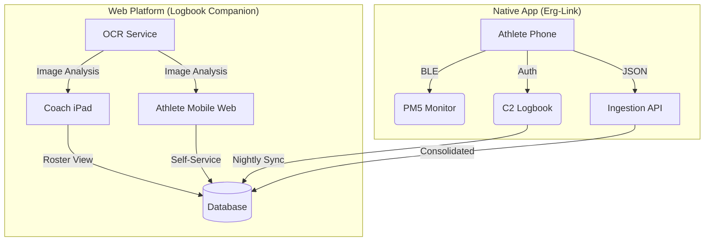

# Feature Spec: Hybrid Workout Capture System

**Status**: Phase 1 Backend Complete / UI Pending
**Date**: 2026-02-05
**Related Context**: `activeContext.md`, `projectBrief.md`

## 1. Executive Summary

The **Hybrid Workout Capture System** allows `LogbookCompanion` to reliably capture workout data for large groups (20+ athletes) in mixed-connectivity environments. It moves beyond the "App per Athlete" dependency by introducing a **"Swiss Cheese" Defense** strategy: layering multiple capture methods to ensure 100% data coverage.

### The "Swiss Cheese" Strategy
*   **Layer 1 (Gold)**: Verified C2 Logbook Sync (Highest Trust).
*   **Layer 2 (Silver)**: Live Erg-Link Bluetooth Stream (Real-Time).
*   **Layer 3 (Bronze)**: Manual/OCR Web Entry (The Safety Net).

## 2. Architecture & Platforms

The system splits responsibilities between the **Web Platform** (Ubiquitous Access) and the **Native App** (Hardware Connectivity).



### Platform Responsibilities

| Feature | Platform | Why? |
| :--- | :--- | :--- |
| **Live Streaming** | **Native (Erg-Link)** | Requires persistent Bluetooth connection. |
| **Broadcast C2** | **Native (Erg-Link)** | Requires stored OAuth tokens + local caching. |
| **Roster Dashboard** | **Web** | visual management tool; needs big screen/filters. |
| **Smart Manual Entry** | **Web** | Universal access (no install needed). |
| **OCR Capture** | **Web** | Camera access via browser is sufficient key. |

---

## 3. Core Concepts

### 3.1 Template-Aware Capture
We never capture data in a vacuum. Everything starts with an **Assignment**.
*   **Assignment**: `Template` + `Group` + `Date`.
*   **The Benefit**: When manual entry is needed, the UI pre-fills the *structure* (e.g., 8 rows for `8x500m`). The user only types the splits.

### 3.2 The Roster Dashboard
The "Commander's View" for the Coach. It answers: *"Who is missing?"*

*   **Filter**: "Show Missing Only".
*   **Action**: Tap Athlete -> "Quick Capture" (Smart Form).

---

## 4. Workflows (User Journeys)

### Journey A: The "A-Team" (connected)
*Athletes with Erg-Link installed.*
1.  **Join**: Enter Session PIN in Erg-Link app.
2.  **Row**: PM5 auto-programmed. Data streams live to Coach.
3.  **Finish**: Result uploaded to C2 Logbook automatically (if linked).
4.  **Status**: 🟢 **Live** -> ✅ **Done**.

### Journey B: The "Self-Service" (Async)
*Athletes without the app, or doing workout on their own time.*
1.  **Access**: Open `logbook-companion.com` on phone.
2.  **Select**: "My Assignments" -> Today's Workout.
3.  **Capture**:
    *   **Smart Form** opens (pre-filled structure).
    *   **Action**: Type splits manually OR snap photo (OCR).
4.  **Status**: Updates to ✅ **Done**.

### Journey C: The "Sweeper" (Coach)
*Coach walking the floor after practice.*
1.  **View**: Open Roster Dashboard -> Filter "Missing".
2.  **Identify**: "There's an empty monitor... that's Jimmy's seat."
3.  **Capture**: Tap Jimmy -> "Quick Capture" -> Snap Photo.
4.  **Status**: Updates to ✅ **Done**.

---

## 5. Data Reconciliation Strategy

We will receive duplicate data (e.g., Jimmy enters it manually, then syncs his ErgData later). We use a **Source Priority** state machine to upgrade data quality without creating duplicates.

```mermaid
graph LR
    Missing((Missing)) -->|Manual/OCR| Bronze[Bronze (Manual)]
    Missing -->|Link Stream| Silver[Silver (Live Stream)]
    Missing -->|C2 Sync| Gold[Gold (Verified C2)]

    Bronze -->|Data Match| Gold
    Silver -->|Data Match| Gold
    
    subgraph "Truth Hierarchy"
    Gold["🥇 C2 Verified"]
    Silver["🥈 Link Stream"]
    Bronze["🥉 Manual/OCR"]
    end
```

**Matching Logic**:
A "Match" is defined as:
*   Same `User`
*   Same `Date` (+/- 5 mins)
*   Same `Total Distance` (+/- 10m) OR `Total Time` (+/- 2s)

---

## 6. Implementation Roadmap

### Phase 1: The "Digital Clipboard" (Web MVP)
*Focus: Enabling Manual/OCR capture for broad coverage.*
1.  **OCR Service**: Deploy `ErgImageProcessor` to Azure.
2.  **Smart Form**: Build the Template-Aware entry grid in Web App.
3.  **Assignments**: DB table linking Templates to Dates/Groups.

### Phase 2: The "Connected Fleet" (Erg-Link Beta)
*Focus: Live streaming and C2 integration.*
1.  **Session Mode**: PIN entry in Erg-Link app.
2.  **C2 Upload**: Direct POST to C2 Logbook from Native App.
3.  **Roster Dashboard**: Real-time status indicators.
